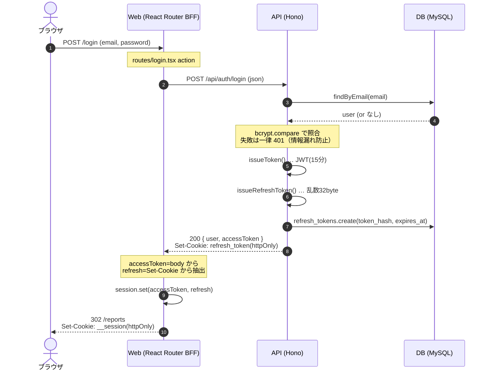
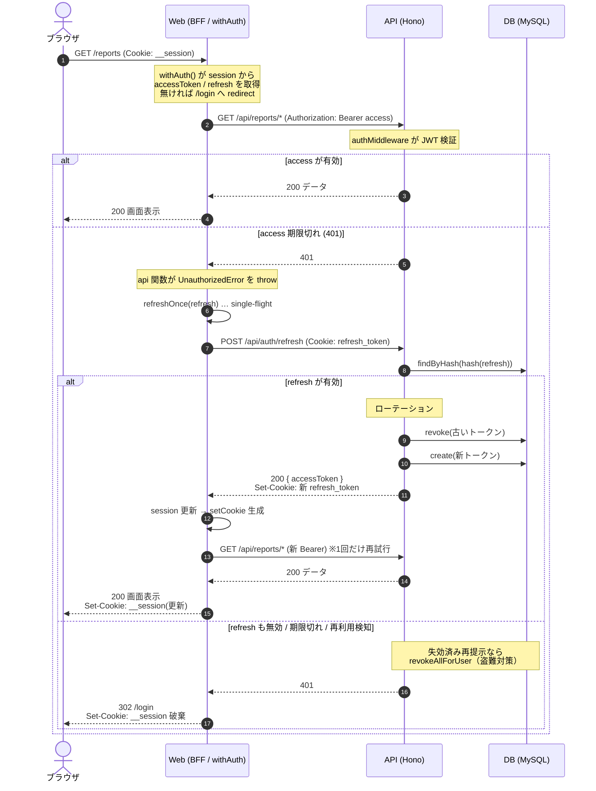
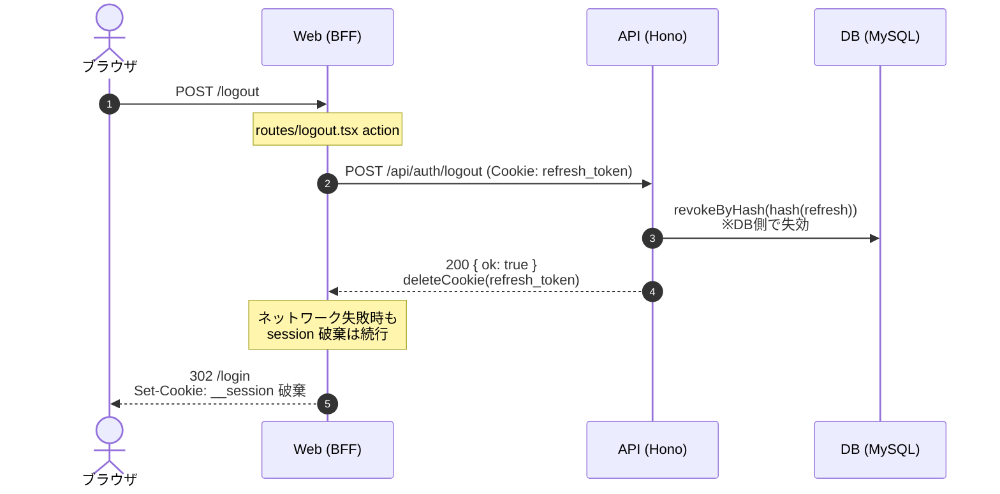

# 認証シーケンス

アーキテクチャは **ブラウザ ↔ Web(React Router BFF) ↔ API(Hono) ↔ DB(MySQL)** の4層構成。
アクセストークン(JWT 15分)とリフレッシュトークン(不透明値 30日)を BFF の `__session`(httpOnly) に保持する。

## ① ログイン / 新規登録

## ② 認証付きデータ取得（自動リフレッシュ込み）

## ③ ログアウト

## 設計のポイント

- **二重Cookie構成**: API は `refresh_token` Cookie を発行するが、BFF はそれをブラウザに渡さず値を抜き出して自前の `__session`(httpOnly) に保管する。ブラウザ JS からトークンが一切読めない（XSS耐性）。
- **トークンローテーション + 再利用検知**: `api/src/services/auth.ts` の `rotateRefreshToken` — 失効済みリフレッシュトークンが再提示されたら盗難とみなし、そのユーザーの全トークンを失効。
- **single-flight**: `web/app/features/auth/with-auth.server.ts` — 1ナビゲーションで複数 loader が同時に 401 → 同時 refresh すると、ローテーションで2本目以降が再利用検知に誤判定され強制ログアウトになるのを防ぐ。
